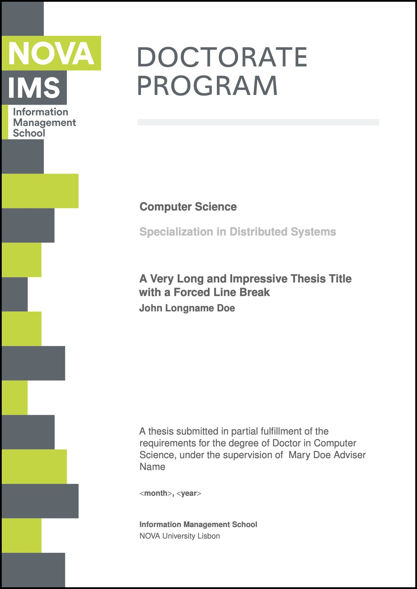
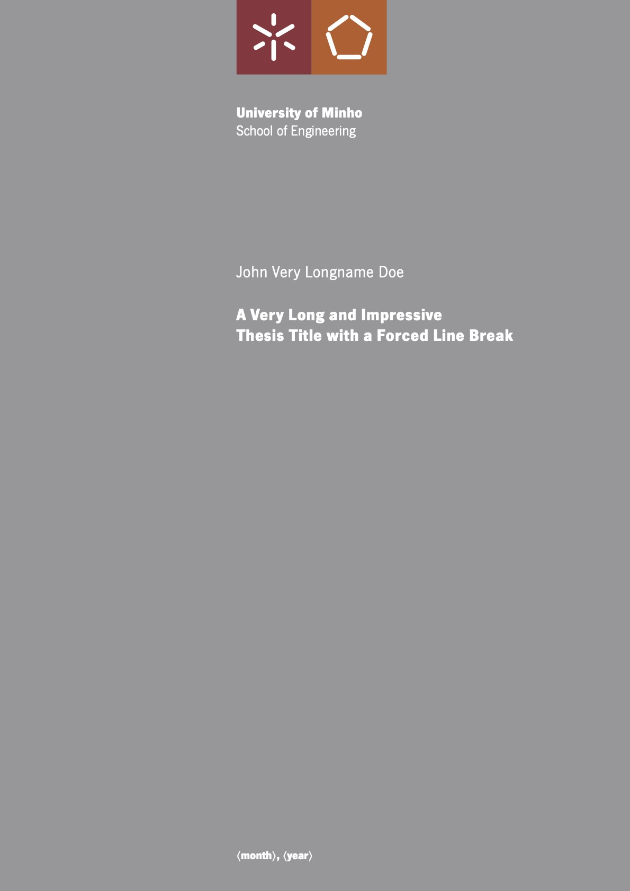
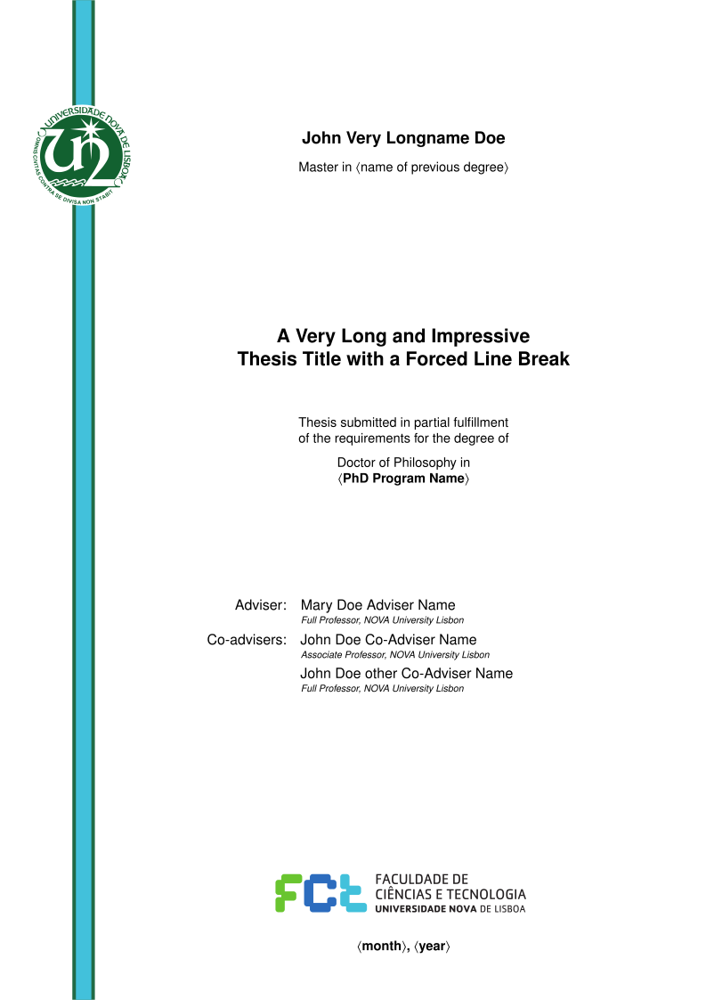
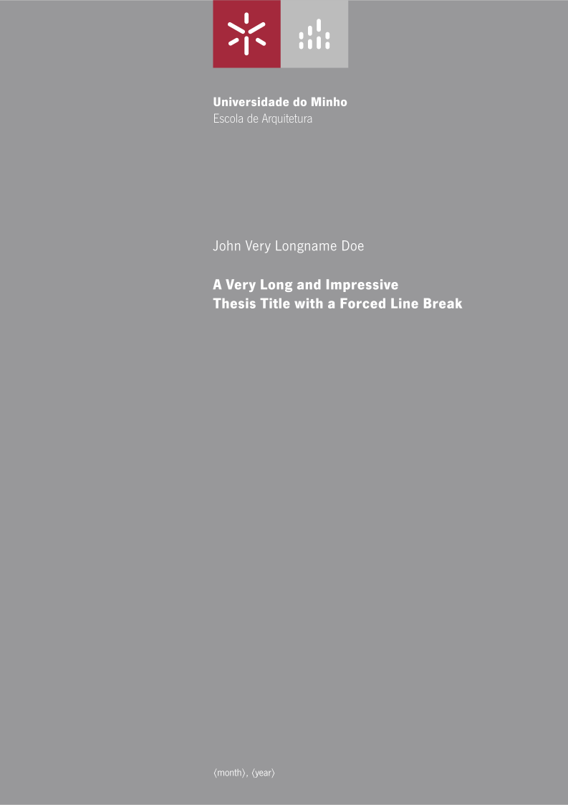
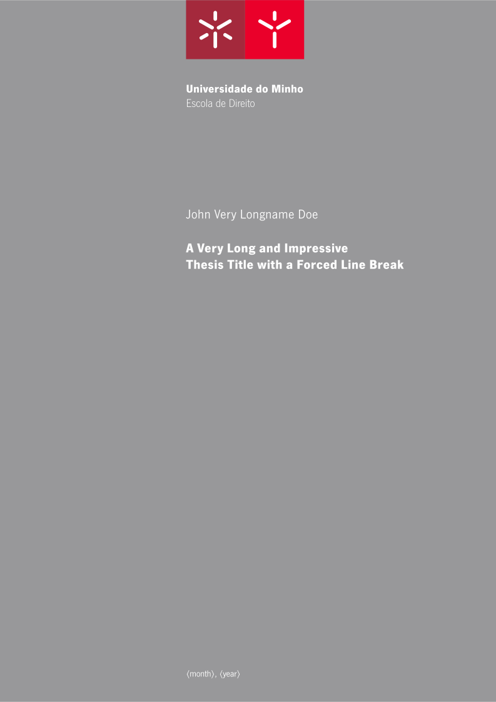
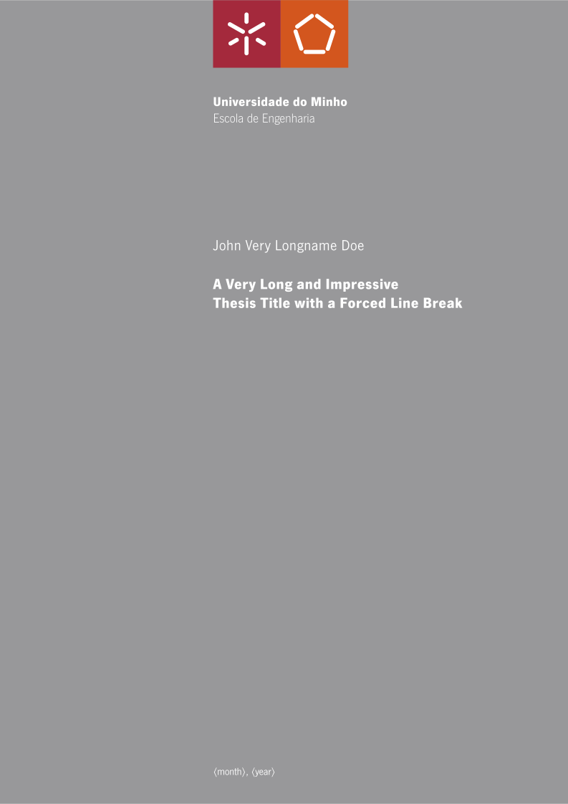
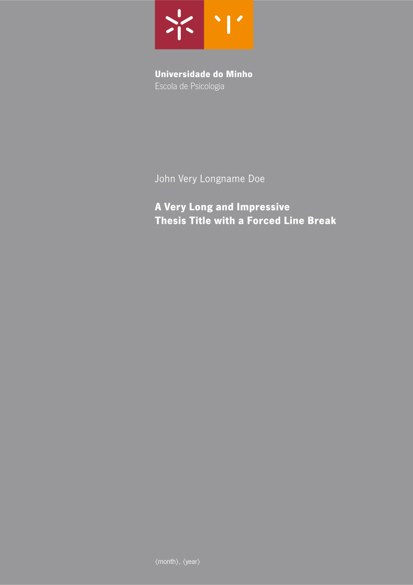
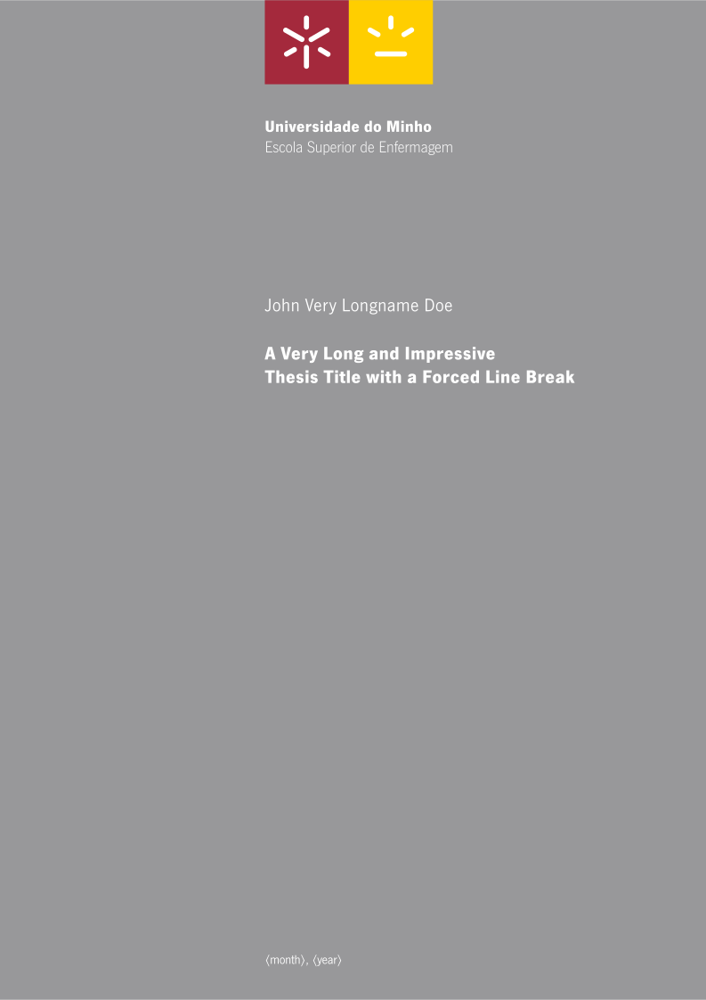
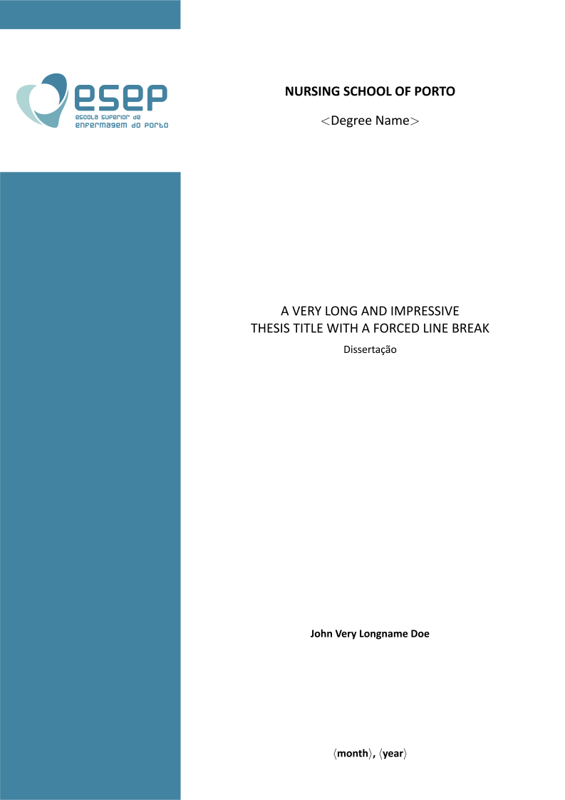

 
<!--  -->

<!-- # “novathesis” LaTeX template -->

](https://img.shields.io/github/last-commit/joaomlourenco/novathesis?color=blue)

--------
## Table of Contents

* [About](#about)
* [Getting Started](#getting-started)
	* [With a Local LaTeX Installation](#with-a-local-latex-installation)
	* [With a Remote Cloud-based Service](#with-a-remote-cloud-based-service)
* [Getting Help](#getting-help)
	* [Problems and Difficulties](#problems-and-difficulties)
	* [Suggestions, Bugs and Feature Requests](#suggestions-bugs-and-feature-requests)
* [Recognition](#recognition)
* [Showcase of supported Schools](#showcase-of-supported-schools)
* [Disclaimer](#disclaimer)
* [Word Templates](#word-templates)

--------

**If you opt for using this project, please give it a star by clicking the (⭐️) at the top right of the page.**

--------
## About

The “novathesis” LaTeX template was initially designed for the PhD thesis and MSc dissertations at [FCT-NOVA — NOVA School of Science and Technology](http://www.fct.unl.pt), Portugal, but currently it supports more schools, namely:
* NOVA University Lisbon
    * [NOVA School for Science and Technology](https://www.fct.unl.pt) (FCT-NOVA)
    * [NOVA Information Management School](https://www.novaims.unl.pt) (NOVA-IMS)
    * [National School of Public Heath](https://www.ensp.unl.pt) (ENSP-NOVA)
    * [Faculdade de Ciências Humanas e Sociais](https://www.fcsh.unl.pt) (FCSH-NOVA)
* University of Lisbon
    * [Instituto Superior Técnico from Universidade de Lisboa](https://tecnico.ulisboa.pt) (IST-UL)
    * [Faculdade de Ciências from  Universidade de Lisboa](https://ciencias.ulisboa.pt) (FC-UL)
* University of Minho
    * [Escola de Arquitetura](https://www.arquitetura.uminho.pt) (EA-UM)
    * [Escola de Ciências](https://www.ecum.uminho.pt) (EC-UM)
    * [Escola de Direito](https://www.direito.uminho.pt) (ED-UM)
    * [Escola de Economia e Gestão](https://www.eeg.uminho.pt) (EEG-UM)
    * [Escolha de Engenharia](https://www.eng.uminho.pt) (EE-UM)
    * [Escola de Medicina](https://www.med.uminho.pt) (EM-UM)
    * [Escola de Psicologia](https://www.psi.uminho.pt) (EP-UM)
    * [Escola Superior de Enfermagem](https://www.ese.uminho.pt) (ESE-UM)
    * [Instituto de Ciências Sociais](https://www.ese.uminho.pt) (ICS-UM)
    * [Instituto de Educação](https://www.ie.uminho.pt) (IE-UM)
    * [Instituto de Letras e Ciências Humanas](https://www.ilch.uminho.pt) (ILCH-UM)
    * [Instituto de Investigação em Biomateriais, Biodegradáveis e Biomiméticos](https://i3bs.uminho.pt) (I3Bs-UM)
* ISCTE – Instituto Universitário de Lisboa
    * [Escola de Tecnologia e Arquitectura](https://ciencia.iscte-iul.pt/schools/escola-tecnologias-arquitectura) (ETA-ISCTE-IUL)
* Instituto Politécnico de Lisboa
    * [Instituto Superior de Engenharia de Lisboa](https://www.isel.pt) (ISEL-IPL)
* Instituto Politécnico de Setúbal
    * [Escola Superior de Saúde](https://www.ess.ips.pt) (ESS-IPS)
    * [Escola Superior de Tecnologia do Barreiro](https://www.estbarreiro.ips.pt) (ESTB-IPS)
* [Escola Superior de Enfermagem do Porto](https://www.esenf.pt/pt/) (ESEP)

The “novathesis” LaTeX template also supports the following degrees from Universities' Consortia:
* Erasmus Mundus [Masters Program in Geospatial Technologies](https://mastergeotech.info)

<!-- The template provides an _easy to use_ setting for you to write your thesis/dissertation in LaTeX:
*  Select your school
* Fill your thesis metadata (title, research field, etc) in the file “*template.tex*”
* Create your thesis/dissertation contents using the files in folder “*Chapters*”
* Process using you favorite LaTeX processor (pdfLaTeX, XeLaTeX or LuaLaTeX) -->

*This work is licensed under the LaTeX Project Public License v1.3c. To view a copy of this license, visit the [LaTeX project public license](https://www.latex-project.org/lppl/lppl-1-3c/).*

--------
## Getting Started

### With a Local LaTeX Installation

*[See below](#with-a-remote-cloud-based-service) for alternatives to a local LaTeX installation*

1. Download LaTeX:
	* **Windows:** install either [MikTeX](https://miktex.org) or [TeX-Live](https://www.tug.org/texlive/).
	* **Linux:** install [TeX-Live](https://www.tug.org/texlive/).
	* **macOS:** install [MacTeX](https://www.tug.org/mactex/) (a macOS version of [TeX-Live](https://www.tug.org/texlive/)).
2. Download “novathesis” by either:
	* Cloning the [GitHub repository](https://github.com/joaomlourenco/novathesis) with <kbd>git clone https://github.com/joaomlourenco/novathesis.git</kbd>; or
	* Downloading the [latest version from the GitHub repository as a Zip file](https://github.com/joaomlourenco/novathesis/archive/master.zip)
3. Compile the document with you favorite LaTeX processor (pdfLaTeX, XeLaTeX or LuaLaTeX):
	* The main file is named “*template.tex*”.  
	* Either load it in your favorite [LaTeX text editor](https://en.wikipedia.org/wiki/Comparison_of_TeX_editors) or compile it in the terminal with
<kbd>latexmk -pdf template</kbd>.
	* If Murphy is elsewhere, LaTeX will create the file “*template.pdf*”, which you may open with your favorite PDF viewer.
4. Edit “*template.tex*”:
	* Select your School, main text language, bibliography style, etc…
	* Fill in your name, thesis title, etc…
	* Name the (separate) files containing the abstracts, chapters, appendices, annexes, etc…
5. Recompile de document:
	* See 3. above.
6. You're done with a beautifully formatted thesis/dissertation! 😃

### With a Remote Cloud-based Service

*[See above](#with-a-local-latex-installation) for using a local installation of LaTeX*

1. Download the [latest version from the GitHub repository as a Zip file](https://github.com/joaomlourenco/novathesis/archive/master.zip).
2. Login to your favorite LaTeX cloud service.  I recommend [Overleaf](https://www.overleaf.com?r=f5160636&rm=d&rs=b) but there are alternatives (these instructions apply to Overleaf  and you'll have to adapt for other providers).
3. In the menu select <kbd>New project</kbd>-><kbd>Upload project</kbd>
4. Upload the zip with all the "novathesis" files.
5. Select “*template.tex*” as the main file.
6. Compile the template and have the first version of the PDF.
4. Edit “*template.tex*”:
	* Select your School, main text language, bibliography style, etc…
	* Fill in your name, thesis title, etc…
	* Name the (separate) files containing the abstracts, chapters, appendices, annexes, etc…
5. Recompile de document.
6. You're done with a beautifully formatted thesis/dissertation! 😃

*NOTE: a deprecated version of the novathesis template (v4.x) is available as an [Overleaf template](https://pt.overleaf.com/latex/templates/new-university-of-lisbon-universidade-nova-de-lisboa-slash-unl-thesis-template/fwbztcrptjmg).  Just select <kbd>open as template</kbd> and go to step 6 above!*

--------
## Getting Help

### Problems and Difficulties

Check the [wiki](https://github.com/joaomlourenco/novathesis/wiki) and have some hope! :smile:

If you couldn't find what you were looking for, ask for help in:

* The [GitHub Discussions page](https://github.com/joaomlourenco/novathesis/discussions) (only EN please) at https://github.com/joaomlourenco/novathesis/discussions.
* The [Facebook page](https://www.facebook.com/groups/novathesis/) (PT or EN) at https://www.facebook.com/groups/novathesis.
* You may also give a look at the [novathesis blog](https://novathesis.blogspot.pt) at https://novathesis.blogspot.pt.

Those are the right places to learn about LaTeX and ask for help!  *Please don't ask for help by email! I will not answer them…*

### Suggestions, Bugs and Feature Requests

* **Do you have a suggestion? ** Please add it to the [wiki](https://github.com/joaomlourenco/novathesis/wiki) and help other users!
* **Did you find a bug?**  Please [open an issue](https://github.com/joaomlourenco/novathesis/issues). Thanks!
* **Would you like to request a new feature (or support of a new School)?**  Please [open an issue](https://github.com/joaomlourenco/novathesis/issues). Thanks!

--------
## Recognition

This template is the result of hundreds (yes! *hundreds*) of hours of work from the main developer.  If you use this template, please be kind and give something back by choosing at least one of the following:

1. Cite the NOVAthesis manual in your thesis/dissertation.  Just use `\cite{novathesis-manual}` (the correct bibliographic reference, as shown below, will be added automatically).

         @Manual{novathesis-manual,
              title        = "{The NOVAthesis Template User's Manual}",
              author       = "João M. Lourenço",
              organization = "NOVA University Lisbon",
              year         = "2021",
              url          = "https://github.com/joaomlourenco/novathesis/raw/master/template.pdf",
         }

1.  [**Make a small donation**](https://paypal.me/novathesis). We will keep a list thanking to all the identified donors that identify themselves in the “*Add special instructions to the seller:*” box.  Our special thanks to:  **2021:** Jessie Harney, João Barbosa, Ricardo Teixeira, Janak Parajuli, Ganesh Prasad Sigdel, Sahibzada Saadoon Hammad, Pedro Rechena, Filipa Carvalho; **2020:** João Carvalho, David Romão, DisplayersereStream, António Estêvão; **2019:** Jorge Barreto, Raissa Almeida.

1. Give the NOVAthesis project a star in GitHub by clicking in the star at the top-right of the [project's home page](https://github.com/joaomlourenco/novathesis).

--------
## Showcase of supported Schools

<!--             -->
<!-- ### Showcase of other usages around the world
    -->

--------
## Disclaimer

These are not official templates for FCT-NOVA nor any other School, although we have done our best to make it fully compliant to each School regulations for thesis/dissertation presentation.

All [contributors](https://github.com/joaomlourenco/novathesis/wiki#help-with-the-project-patches-and-new-features), both sporadic and regular, are welcome. :) Please [contact me](http://docentes.fct.unl.pt/joao-lourenco) to join the team.

--------
## Word Templates

*If you are here looking for the (deprecated) Word templates (not maintained anymore), please go to [this other repository](https://github.com/joaomlourenco/novathesis_word).*
