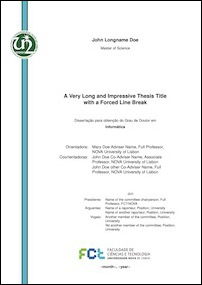
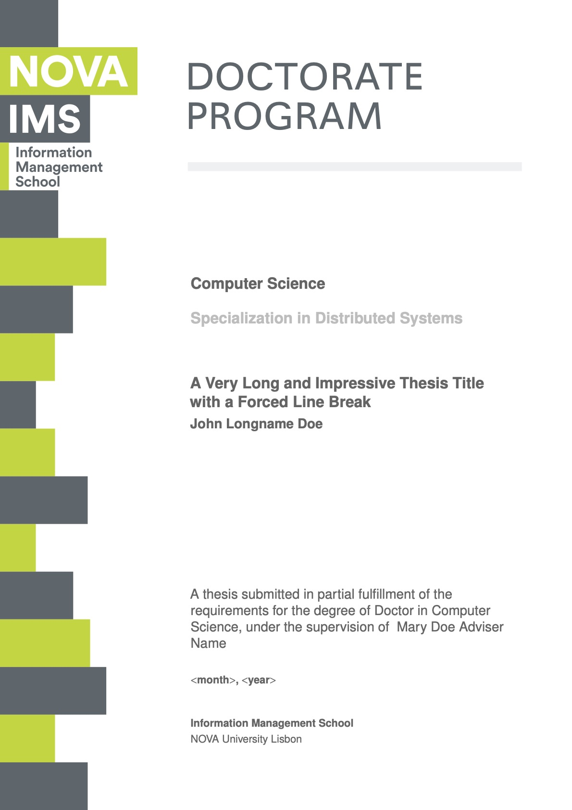
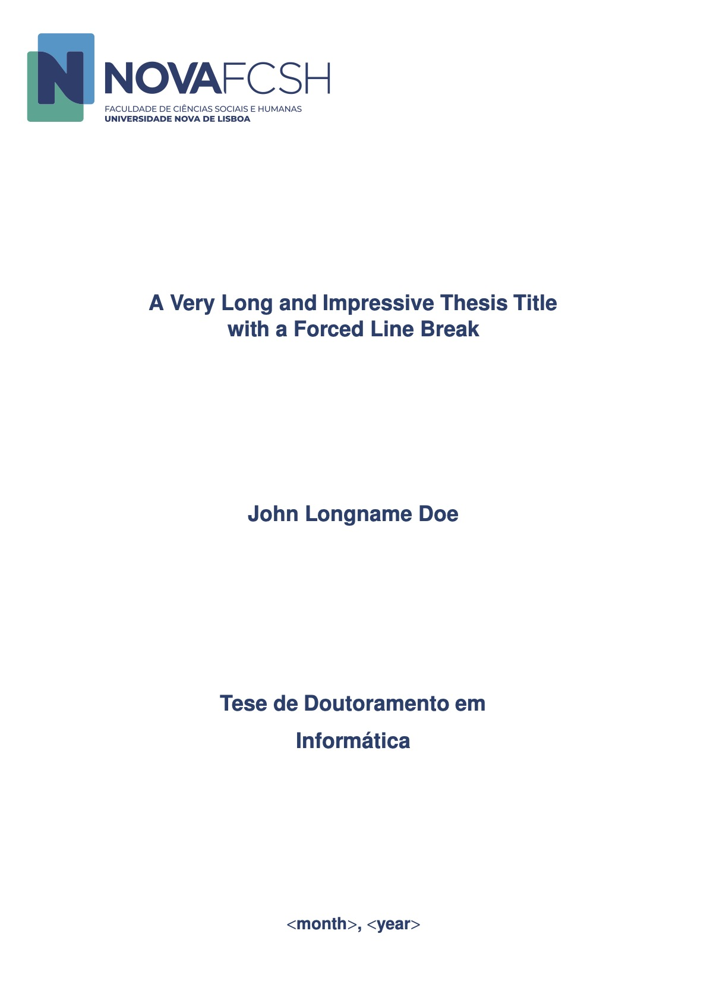
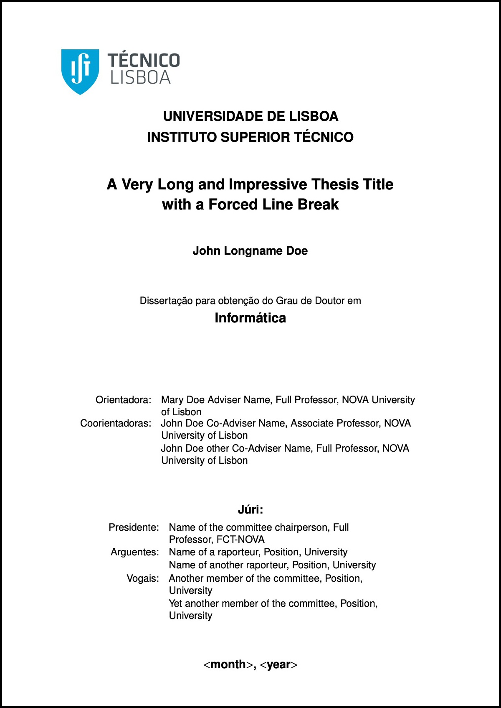
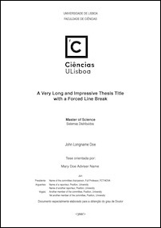
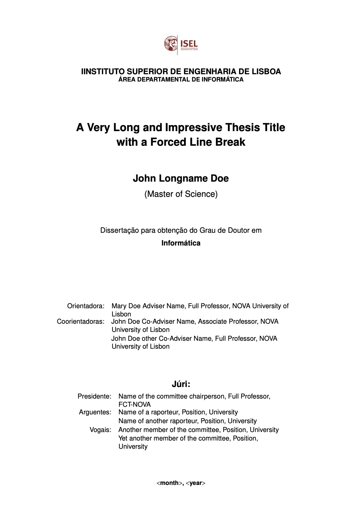
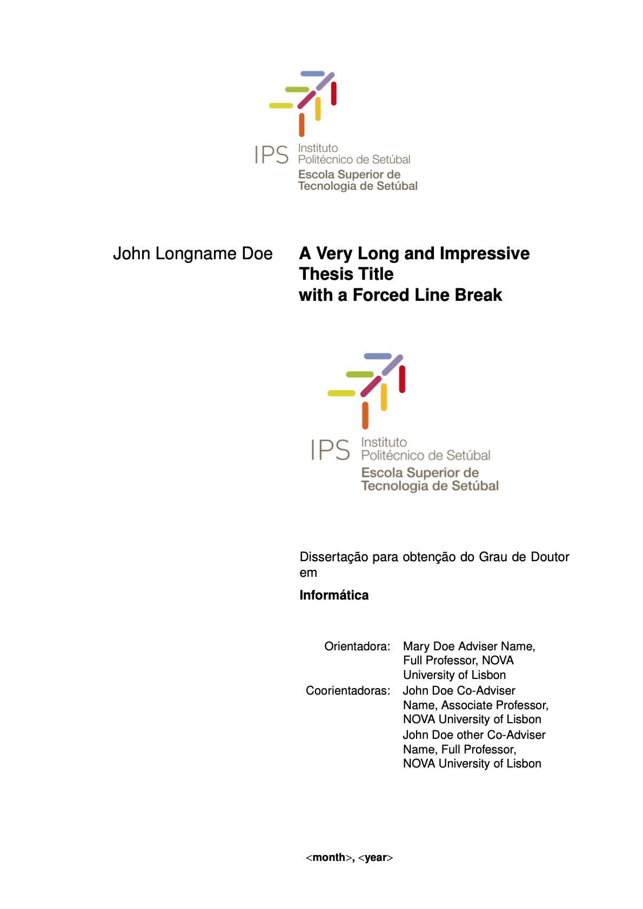
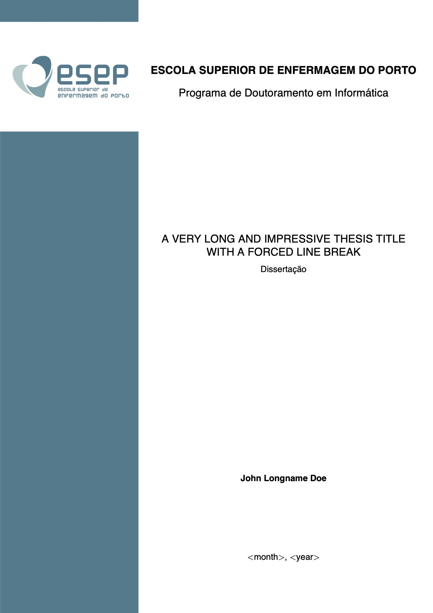

# _novathesis_ LaTeX template
%% Version 2021-01-03 [5.1.12]

--------

        

--------

The _novathesis_ LaTeX class is a thesis template initially designed for the PhD and MSc thesis at [FCT-NOVA — NOVA School of Science and Technology](http://www.fct.unl.pt), Portugal, but currently it supports more schools, namely:
* NOVA University Lisbon
    * [NOVA School for Science and Technology](https://www.fct.unl.pt) (FCT-NOVA)
    * [NOVA Information Management School](https://www.novaims.unl.pt) (NOVA-IMS)
    * [National School of Public Heath](https://www.ensp.unl.pt) (ENSP-NOVA)
    * [Faculdade de Ciências Humanas e Sociais](https://www.fcsh.unl.pt) (FCSH-NOVA)
* University of Lisbon
    * [Instituto Superior Técnico from Universidade de Lisboa](https://tecnico.ulisboa.pt) (IST-UL)
    * [Faculdade de Ciências from  Universidade de Lisboa](https://ciencias.ulisboa.pt) (FC-UL)
* Instituto Politécnico de Lisboa
    * [Instituto Superior de Engenharia de Lisboa](https://www.isel.pt) (ISEL-IPL)
* Instituto Politécnico de Setúbal
    * [Escola Superior de Saúde](https://www.ess.ips.pt) (ESS-IPS)
    * [Escola Superior de Tecnologia do Barreiro](https://www.estbarreiro.ips.pt) (ESTB-IPS)
* [Escola Superior de Enfermagem do Porto](https://www.esenf.pt/pt/) (ESEP)

The template provides an _easy to use_ setting for you to write your thesis/dissertation in LaTeX:
*  Select your school
* Fill your thesis metadata (title, research field, etc) in the file “template.tex”
* Create your thesis/dissertation contents using the files in folder “_Chapters_”
* Process using you favorite LaTeX processor (pdfLaTeX, XeLaTeX or LuaLaTeX)

*This work is licensed under the LATEX Project Public License v1.3c. To view a copy of this license, visit the [LaTeX project public license](https://www.latex-project.org/lppl/lppl-1-3c/).*

## Donations

This template is the result of hundreds (yes! *hundreds*) of hours of work from the main developer.  If you think this template really helped you while writing your thesis, think about making a [**donation**](https://paypal.me/novathesis). We will keep a list thanking to all the identified donors that identify themselves in the “*Add special instructions to the seller:*” box.

Thank you to our donnors:

##### Donors 2020
João Carvalho, David Romão, DisplayersereStream, António Estêvão.

##### Donnors 2019
Jorge Barreto, Raissa Almeida.

## Getting Started

### Download

Get the latest release from the [releases page](https://github.com/joaomlourenco/novathesis/releases)!

### Problems and Difficulties

Check the [wiki](https://github.com/joaomlourenco/novathesis/wiki) and have some hope! :smile:

If you couldn't find what you were looking for, ask for help in:

* The [facebook page](https://www.facebook.com/groups/novathesis/) (PT or EN) at https://www.facebook.com/groups/novathesis.
* The [google group](https://groups.google.com/forum/#!forum/novathesis) (EN only please) at https://groups.google.com/forum/#!forum/novathesis.
* You may also give a look at the [novathesis blog](https://novathesis.blogspot.pt) at https://novathesis.blogspot.pt.

Those are the right places to learn about LaTeX and ask for help!  *Please don't ask for help by email! I will not answer them…*

### Suggestions and Recommendations

Please add them to the [wiki](https://github.com/joaomlourenco/novathesis/wiki) and help other users!

**Did you find a bug?**  Please [open an issue](https://github.com/joaomlourenco/novathesis/issues). Thanks!

## Disclaimer

These are not official templates for FCT-NOVA or any other School, although we have done our best to make it fully compliant to each School regulations for thesis/dissertation presentation.

All contributors, both sporadic and regular, are welcome. :) Please [contact me](http://docentes.fct.unl.pt/joao-lourenco) to join the team.

--------

*If you are here looking for the (deprecated) Word templates (not maintained anymore), please go to [this other repository](https://github.com/joaomlourenco/novathesis_word).*
